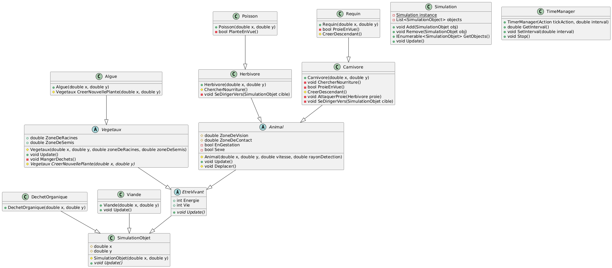
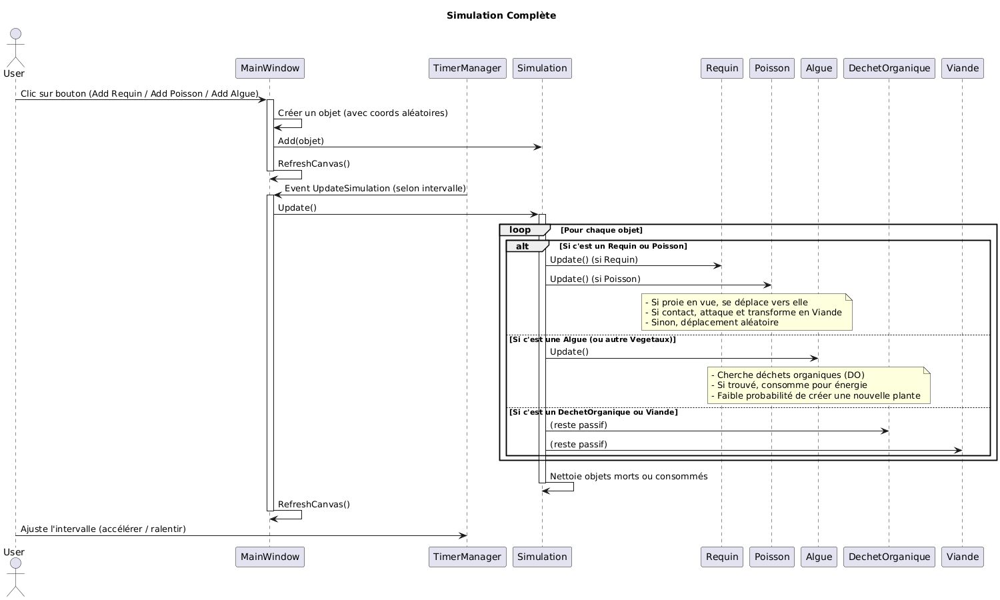
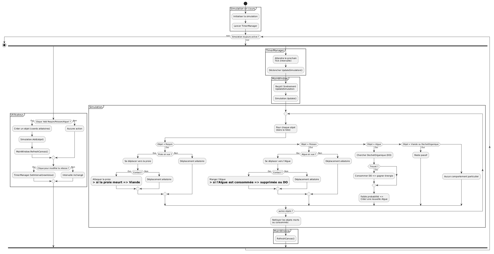

# Rapport sur la Simulation d'un Écosystème

Ce document présente :
- Un diagramme de classes,
- Un diagramme de séquence,
- Un diagramme d’activité,
- Et la description (avec justifications) de deux principes SOLID (OCP et SRP) appliqués dans ce projet.

---

1. Diagramme de classes

Voici le diagramme de classes, qui illustre la hiérarchie et les relations entre les différents éléments (Simulation, TimeManager, EtreVivant, Animal, etc.) :

*(Ce diagramme montre comment la classe `Simulation` agrège des `SimulationObjet`, comment `Animal` hérite de `EtreVivant`, et ainsi de suite. On y voit aussi la distinction entre `Carnivore`, `Herbivore`, `Poisson`, etc.)*

---

2. Diagramme de séquence

Le diagramme de séquence suivant montre les appels et les interactions entre les objets durant le déroulement de la simulation (initialisation, boucle de simulation, mises à jour, etc.) :

*(Ici, chaque “alt” ou “opt” met en évidence les différents comportements selon que l’on ait un Animal carnivore, herbivore, poisson, un végétal ou un déchet organique à traiter.)*

---

3. Diagramme d’activité

Le diagramme d’activité décrit le flux de contrôle global de la simulation :  
- Démarrage,  
- Boucle principale (traitement des objets, mises à jour, gestation),  
- Ajout/suppression d’éléments,  
- Et enfin l’arrêt de la simulation.

*(Les décisions conditionnelles y sont représentées, ainsi que les actions propres à chaque type d’entité : Animal, Végétal, DéchetOrganique.)*

---

4. Principes SOLID

Dans ce projet, plusieurs principes SOLID (Single Responsibility, Open/Closed, etc.) sont mis en œuvre. Nous en mettons en avant deux ci-dessous.

4.1 Principe OCP (Open/Closed Principle)

La classe Carnivore hérite de la classe Animal et peut être étendue sans nécessiter de modifications dans Carnivore.cs (par exemple, Requin). La méthode `ChercherNourriture` illustre ce comportement spécialisé tout en préservant la logique de base définie dans la superclasse Animal. Ainsi, de nouvelles fonctionnalités (comme l’ajout d’autres carnivores) peuvent être introduites sans modifier le code déjà existant. Cela respecte donc le principe OCP.

En d’autres termes, l’architecture reste ouverte à l’extension (on peut ajouter de nouvelles sous-classes comme Requin) mais fermée à la modification (on ne touche pas au code existant dans `Carnivore.cs` ou `Animal.cs`, on “ajoute” simplement).

4.2 Principe SRP (Single Responsibility Principle)

La classe Animal se limite à gérer les spécificités propres aux animaux (comme la reproduction, la vision, le sexe) et délègue les mécanismes plus généraux (réduction d’énergie, gestion de vie) à sa superclasse EtreVivant. Les fonctionnalités associées à Animal (ZoneDeVision, ZoneDeContact, sexe, etc.) apparaissent clairement, tandis que la partie commune (par exemple `base.Update()`) est prise en charge par EtreVivant, illustrant une responsabilité unique et donc conforme au SRP. »**

Ainsi, la responsabilité unique de `Animal` est focalisée sur les comportements propres aux animaux (déplacement, reproduction, etc.), tandis qu’`EtreVivant` gère la survie, l’énergie et l’état vital — ce qui simplifie la maintenance et renforce la cohérence du code.

---

**Fin du rapport.**
